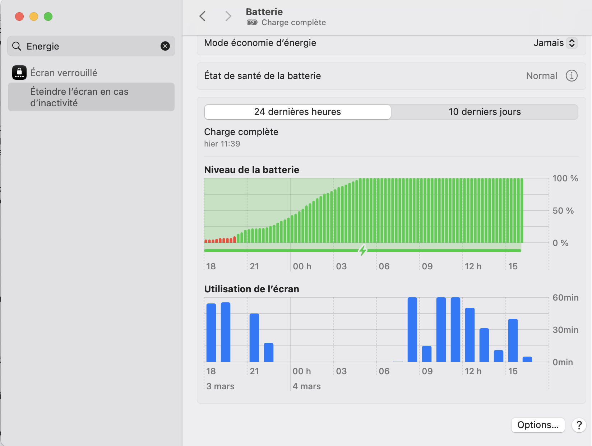
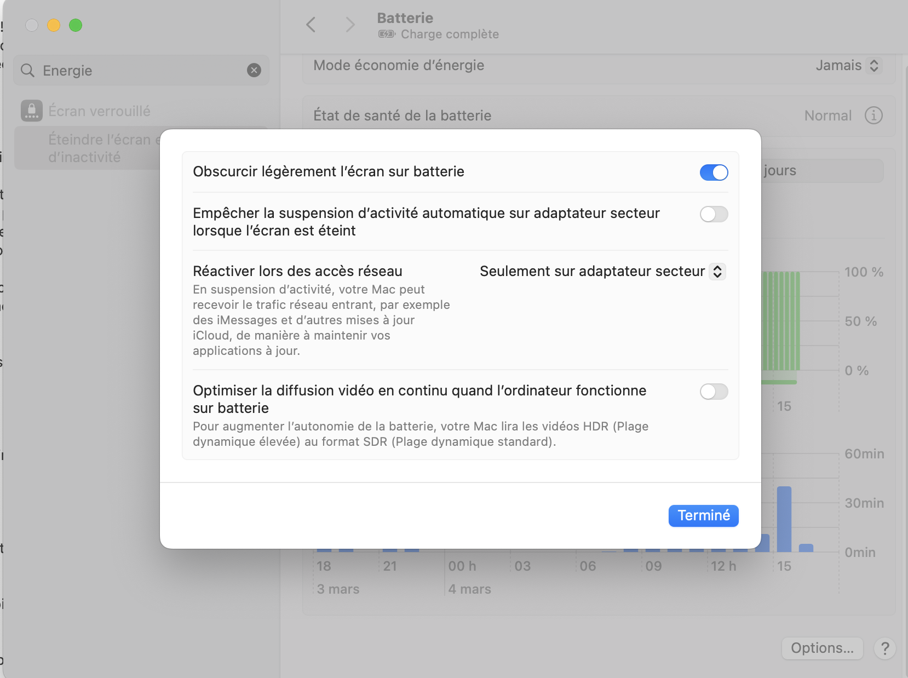

# Programmer des taches automatiques dans Claude Code

Fais tourner Claude Code automatiquement pendant que tu dors. Ce guide t'explique comment installer et configurer le plugin **Claude Code Scheduler** pour que Claude execute des taches a heure fixe — sans que tu sois devant ton ecran.

---

## C'est quoi le principe ?

Imagine un reveil sur ton ordinateur. Sauf qu'au lieu de sonner, il lance Claude Code. Claude fait le boulot (scanner des tendances, trier des mails, generer du contenu...) et met le resultat la ou tu veux (Notion, un fichier, etc.). Tu te reveilles, c'est pret.

**Comment ca marche :**

```
Toi : "Tous les jours a 9h, scanne les tendances YouTube"
                        |
                        v
        Le plugin configure ton ordinateur
                        |
                        v
        Chaque matin a 9h, ton ordi lance Claude
                        |
                        v
        Claude execute la tache automatiquement
                        |
                        v
        Le resultat t'attend dans Notion (ou ailleurs)
```

**Cout :** 0 euros. Ca utilise ton abonnement Claude (Pro ou Max). Pas de cout supplementaire.

---

## Prerequis

- **Claude Code** installe sur ton ordinateur (version 1.0.33 ou plus recente)
- **Un abonnement Claude** Pro (20$/mois) ou Max — c'est ce qui permet a Claude de tourner en arriere-plan
- **macOS** (Mac) ou **Windows**

Pour verifier ta version de Claude Code, ouvre un terminal et tape :
```bash
claude --version
```

---

## Etape 1 — Installer le plugin Scheduler

Ouvre Claude Code (dans ton terminal ou VS Code) et tape ces 2 commandes :

```
/plugin marketplace add jshchnz/claude-code-scheduler
```

Puis :

```
/plugin install scheduler@claude-scheduler
```

Ensuite, **ferme Claude Code et rouvre-le**. Le plugin ne s'active qu'apres un redemarrage.

Pour verifier que c'est bien installe, tape :
```
/scheduler:schedule-status
```

Si ca repond sans erreur, c'est bon.

---

## Etape 2 — Configurer ton ordinateur pour qu'il ne dorme pas

C'est **la etape la plus importante**. Si ton ordinateur se met en veille (dort), rien ne tourne. Il faut lui dire de rester actif meme quand l'ecran est eteint.

### Sur Mac (macOS)

1. Ouvre **Reglages Systeme** (l'icone en forme de roue dentee)
2. Cherche **"Energie"** dans la barre de recherche, ou va dans **Batterie** (sur un MacBook)
3. Clique sur **Options...** en bas a droite
4. Active **"Empecher la suspension d'activite automatique sur adaptateur secteur lorsque l'ecran est eteint"**
5. Clique sur **Termine**

Voici a quoi ca ressemble :



Puis dans les options :



L'ecran s'eteint normalement pour economiser de l'energie, mais l'ordinateur reste actif en arriere-plan. Les taches planifiees tournent sans probleme.

**Si tu as un MacBook :** il faut qu'il soit **branche sur secteur**. Sinon la batterie se vide pendant la nuit.

**Consommation electrique :** environ 10-15 watts ecran eteint. Ca revient a ~1-2 euros par mois sur ta facture. Moins qu'une ampoule LED allumee.

### Sur Windows

1. Ouvre **Parametres** (touche Windows + I)
2. Va dans **Systeme** > **Alimentation et batterie**
3. Dans **Ecran et veille**, mets **"Mettre l'appareil en veille"** sur **Jamais**

Pareil que sur Mac : l'ecran s'eteint, mais l'ordinateur reste actif.

**Si tu as un PC portable :** branche-le sur secteur.

---

## Etape 3 — Programmer ta premiere tache

Dans Claude Code, tape simplement :

```
/scheduler:schedule-add
```

Puis decris ce que tu veux **en langage naturel**. Par exemple :

```
Every day at 9am, scan YouTube trends for AI and Claude topics and save the report to Notion
```

Ou :

```
Every weekday at 8am, triage my emails and classify them by importance
```

Claude va :
1. Comprendre ce que tu veux
2. Convertir "every day at 9am" en planning (cron : `0 9 * * *`)
3. Te demander si la tache doit etre **autonome** (= tourne sans ton approbation) — tu dis oui
4. Configurer le planificateur de ton ordinateur automatiquement

C'est fait. La tache tournera chaque jour a l'heure prevue.

---

## Exemple concret : Scanner les tendances YouTube a 9h

Voici un cas reel. Tu veux que Claude scanne les tendances AI/Claude tous les matins et mette un rapport dans Notion.

**Ce que tu tapes dans Claude Code :**

```
/scheduler:schedule-add
```

**Ce que tu dis a Claude :**

```
Every day at 9am, run the youtube-trends skill: scan trending AI/Claude topics
from Anthropic, Reddit, YouTube and X/Twitter. Generate scored video ideas
and save the full report to the Notion "YouTube trends" database.
```

**Ce qui se passe ensuite (automatiquement, chaque matin) :**
1. A 9h, ton ordinateur lance Claude Code en arriere-plan
2. Claude scanne 4 sources : Anthropic (actualites officielles), Reddit (r/ClaudeAI), YouTube (videos recentes), X/Twitter (tweets viraux)
3. Claude genere des idees de video avec un score de pertinence
4. Claude sauvegarde le rapport dans ta base Notion
5. Tu ouvres Notion quand tu veux — le rapport est la

---

## Comment ca marche en coulisses

Tu n'as pas besoin de comprendre cette partie pour utiliser le plugin. Mais si tu es curieux :

### Sur Mac

Le plugin utilise **launchd** — c'est le systeme integre de macOS pour planifier des taches. Quand tu programmes une tache, le plugin cree un petit fichier de configuration qui dit a macOS : "a telle heure, lance cette commande". C'est exactement ce qu'Apple utilise pour ses propres mises a jour automatiques.

Les fichiers de configuration sont dans : `~/Library/LaunchAgents/`

### Sur Windows

Le plugin utilise le **Planificateur de taches** (Task Scheduler) — l'equivalent Windows de launchd. Meme principe : un fichier de configuration dit a Windows quand lancer la commande.

Tu peux voir tes taches dans : Demarrer > Planificateur de taches

### La commande qui tourne

Dans les deux cas, a l'heure prevue, ton ordinateur execute :

```bash
claude -p "ta commande ici" --dangerously-skip-permissions
```

- `claude -p` = mode silencieux (pas d'interface, Claude fait le boulot et s'arrete)
- `--dangerously-skip-permissions` = Claude agit sans te demander la permission a chaque etape (necessaire car tu n'es pas devant l'ecran). Le nom fait peur, mais c'est normal pour de l'automatisation.

---

## Commandes de gestion

Une fois le plugin installe, voici les commandes disponibles dans Claude Code :

| Commande | Ce que ca fait |
|----------|---------------|
| `/scheduler:schedule-add` | Programmer une nouvelle tache |
| `/scheduler:schedule-list` | Voir toutes tes taches planifiees |
| `/scheduler:schedule-status` | Verifier que le systeme fonctionne bien |
| `/scheduler:schedule-run <id>` | Lancer une tache maintenant (sans attendre l'heure) |
| `/scheduler:schedule-logs` | Voir les resultats des executions passees |
| `/scheduler:schedule-remove <id>` | Supprimer une tache |

L'`<id>` est un identifiant unique que tu retrouves avec `/scheduler:schedule-list`.

---

## Comment verifier que ca marche

### Test immediat

Apres avoir cree une tache, force son execution pour verifier :

```
/scheduler:schedule-list
```

Note l'identifiant de ta tache, puis :

```
/scheduler:schedule-run <id>
```

Claude va executer la tache immediatement. Verifie que le resultat arrive bien (dans Notion, par email, etc.).

### Verifier les logs

Les resultats de chaque execution sont enregistres. Pour les voir :

```
/scheduler:schedule-logs
```

Tu peux aussi regarder les fichiers de log directement :
- **Mac :** `~/.claude/logs/`
- **Windows :** `%USERPROFILE%\.claude\logs\`

### Si ca ne marche pas

1. **Le Mac/PC etait en veille ?** → Verifie les reglages d'energie (Etape 2)
2. **Le MacBook n'etait pas branche ?** → La batterie s'est videe, branche-le
3. **Claude Code pas a jour ?** → Lance `claude update` dans le terminal
4. **Le plugin n'est pas charge ?** → Redemarre Claude Code (ferme et rouvre)

---

## FAQ

**Ca coute quelque chose en plus ?**
Non. Les taches utilisent ton abonnement Claude (Pro ou Max). Pas de frais supplementaires.

**Je peux programmer plusieurs taches ?**
Oui, autant que tu veux. Chaque tache a son propre horaire.

**Ca marche si mon ordinateur est eteint ?**
Non. L'ordinateur doit etre allume (ou ecran eteint, mais pas en veille). Si tu l'eteins le soir, la tache de 9h ne tournera pas.

**Et si mon ordinateur dormait a l'heure prevue ?**
Sur Mac, launchd rattrape la tache des que le Mac se reveille. Sur Windows, le Planificateur de taches a une option similaire ("Executer la tache des que possible apres un demarrage manque").

**C'est quoi `--dangerously-skip-permissions` ? C'est dangereux ?**
Non. C'est le mode "autonome" de Claude Code. Normalement, Claude te demande la permission avant chaque action (lire un fichier, lancer une commande). En mode autonome, il agit seul. Le nom est volontairement alarmant pour que tu en sois conscient, mais c'est necessaire et normal pour les taches automatiques.

**Ca marche sur Linux ?**
Oui. Le plugin utilise `crontab` sur Linux. Le principe est identique.

**Je peux voir ce que Claude a fait ?**
Oui, tout est dans les logs : `/scheduler:schedule-logs` ou dans le dossier `~/.claude/logs/`.

---

## Credits

- Plugin : [claude-code-scheduler](https://github.com/jshchnz/claude-code-scheduler) par jshchnz
- Guide : Colin Blain — [LinkedIn](https://www.linkedin.com/in/colin-blain/)
